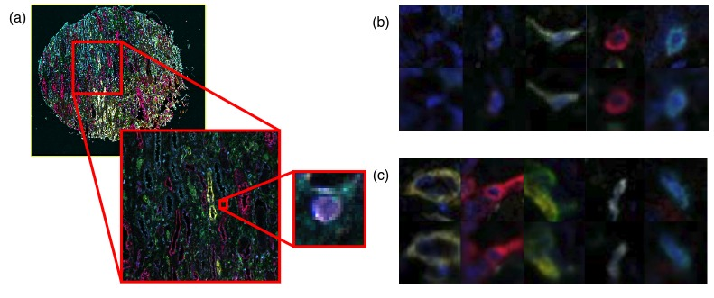
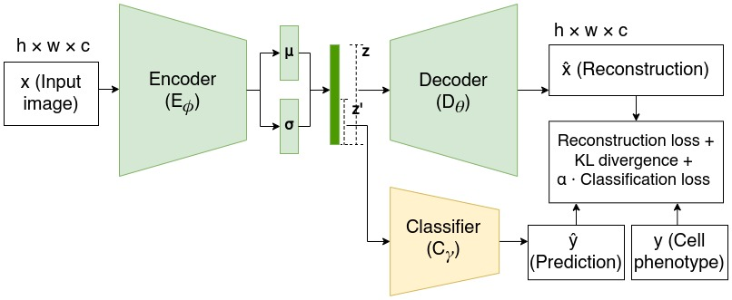
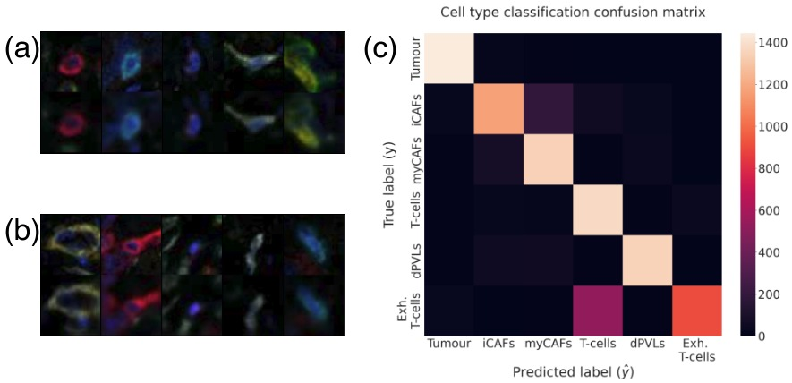

# Semi-supervised variational autoencoder for cell feature extraction in multiplexed immunofluorescence images

## Abstract
Advancements in digital imaging technologies have sparked increased interest in using multiplexed immunofluorescence (mIF) images to visualize and identify the interactions between specific immunophenotypes with the tumor microenvironment at the cellular level. Current state-of-the-art multiplexed immunofluorescence image analysis pipelines depend on cell feature representations characterized by morphological and stain intensity-based metrics generated using simple statistical and machine learning-based tools. However, these methods are not capable of generating complex representations of cells. We propose a deep learning-based cell feature extraction model using a variational autoencoder with supervision using a latent subspace to extract cell features in mIF images. We perform cell phenotype classification using a cohort of more than 44,000 multiplexed immunofluorescence cell image patches extracted across 1,093 tissue microarray cores of breast cancer patients, to demonstrate the success of our model against current and alternative methods.

## Results

### Dataset and Experimental Details
Our dataset consists of 18 TMA slide with each having 9 channels corresponding to 9 biomarker stains (PD1, CD140b, CD146, Thy1, PanCK, CD8, α-SMA, CD31, DAPI) and an additional autofluorescence channel that are all registered. In addition, we also observe that PanCK and CD140b stains are dominant stains in this dataset. Each TMA contains cores of approximately 1.25 µm in diameter scanned at 0.5 µm/pixel resolution. Our dataset consists of 1,093 TMA cores collected from a cohort of 450 breast cancer patients.

### An example image is shown below


### Architecture diagram is shown below


### Comparison of Cell Classification Results for Different Models
| Method | Image Size | Embedding Size | Accuracy | Precision | Recall |
| ------ | ---------- | -------------- | -------- | --------- | ------ |
| ResNet50 Pretrained on ImageNet with PCA | 48×48×9* | 1,152 | 0.7191 | 0.7180 | 0.7215 |
| Standard VAE [9] | 48×48×9 | 9,216 | 0.8074 | 0.8147 | 0.8125 |
| Morphological Features QuPath [4] | - | 156 | 0.8084 | 0.8136 | 0.8088 |
| Semi-Supervised Autoencoder [14] | 48×48×9 | 9,216 | 0.8201 | 0.8464 | 0.8257 |
| Proposed Model | 48×48×9 | 1,152 | 0.8486 | 0.8654 | 0.8507 |

### Image Reconstructions and Confusion Matrix


## Coding Instructions

### Environment Setup
To replicate the experiments, follow the steps below to set up your environment:

1. **Clone the repository**
   ```bash
   git clone https://github.com/PiumiDS/sVAE.git
   ```

2. **Create a virtual environment**
   ```bash
   python3 -m venv venv
   source venv/bin/activate
   ```

3. **Install the dependencies**
   The requirements file contains multiple libraries that are used for multiple experiments. You MUST double check if the libraries are necessary for this code or not. 
   ```bash
   pip install -r requirements.txt
   ```

### Data Preparation
For our experiment mIF images and the corresponding labels are placed as below. Since the paths are provided in .npy files, you can change the parametrs as necessary to read files.
```
data/
└── tmAs/
    ├── TMA1/
    │   ├── image1_label.tif
    │   ├── image2_label.tif
    │   └── ...
    └── TMA2/
        ├── image1_label.tif
        ├── image2_label.tif
        └── ...
```

### Training the Model
To train the proposed model, run the following command, You will have to change the parameters to suit the input and model size. 
```bash
python train.py
```

### Evaluating the Model
To evaluate the model,
Currently, the evaluation is provided on the same file. Since the dataset is private, we have avoided releasing a second set of evaluation code snippets. If you need help please reachout on p.sandarenu@unsw.edu.au

---

